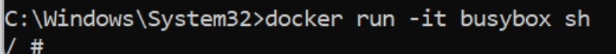
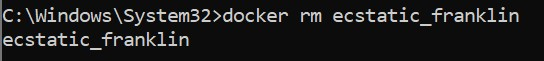
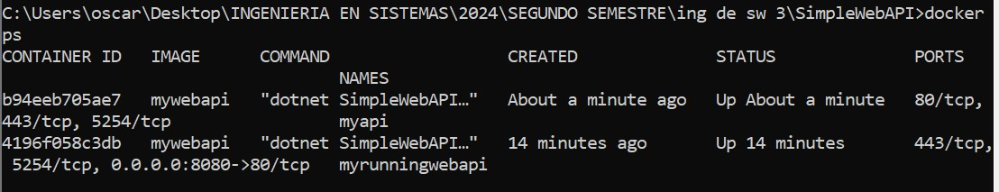
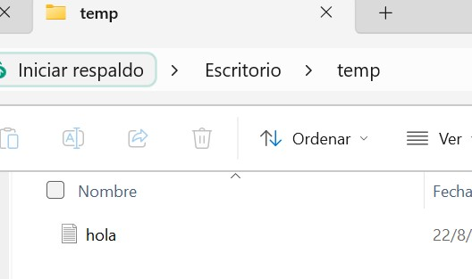

### RIVERO BOSCH JOSEFINA

# 4- Desarrollo:

# 1- Instalar Docker Community Edition
Diferentes opciones para cada sistema operativo
https://docs.docker.com/
Ejecutar el siguiente comando para comprobar versiones de cliente y demonio.

docker versión

# 2- Explorar DockerHub
Registrase en docker hub: https://hub.docker.com/
Familiarizarse con el portal

# 3- Obtener la imagen BusyBox
Ejecutar el siguiente comando, para bajar una imagen de DockerHub

docker pull busybox

Verificar qué versión y tamaño tiene la imagen bajada, obtener una lista de imágenes locales:

docker images

# 4- Ejecutando contenedores
Ejecutar un contenedor utilizando el comando run de docker:

docker run busybox

Explicar porque no se obtuvo ningún resultado:

El comando docker run busybox ejecuta un contenedor basado en la imagen de busybox, pero no especifica un comando para ejecutar dentro del contenedor. busybox es una imagen extremadamente ligera que contiene un conjunto básico de utilidades de Unix. Por defecto, cuando se ejecuta sin un comando específico, el contenedor simplemente inicia y finaliza inmediatamente, ya que no tiene un proceso que mantener en ejecución.

Especificamos algún comando a correr dentro del contenedor, ejecutar por ejemplo:

docker run busybox echo "Hola Mundo"

Ver los contenedores ejecutados utilizando el comando ps:

docker ps

Vemos que no existe nada en ejecución, correr entonces:

docker ps -a

Mostrar el resultado y explicar que se obtuvo como salida del comando anterior.

Este comando lista todos los contenedores, tanto los que están actualmente en ejecución como los que se han detenido.

En la salida se puede observar lo siguiente:

CONTAINER ID: 0bf82d4df2da es el identificador del contenedor.

IMAGE: busybox, que es la imagen de Docker utilizada para crear el contenedor.

COMMAND: "echo 'Hola Mundo'", es el comando que se ejecutó dentro del contenedor.

CREATED: 29 seconds ago, indica que el contenedor fue creado hace 29 segundos.

STATUS: Exited (0) 28 seconds ago, indica que el contenedor se ejecutó y luego terminó su ejecución (con un código de salida 0, lo que significa que se ejecutó correctamente) hace 28 segundos.

NAMES: affectionate_tesla, es el nombre asignado automáticamente al contenedor.

# 5- Ejecutando en modo interactivo

Ejecutar el siguiente comando
docker run -it busybox sh

Para cada uno de los siguientes comandos dentro de contenedor, mostrar los resultados:
ps

uptime

free

ls -l /

Salimos del contenedor con:
exit

# 6- Borrando contenedores terminados
Obtener la lista de contenedores
docker ps -a

Para borrar podemos utilizar el id o el nombre (autogenerado si no se especifica) de contenedor que se desee, por ejemplo:
docker rm elated_lalande

Para borrar todos los contenedores que no estén corriendo, ejecutar cualquiera de los siguientes comandos:
docker rm $(docker ps -a -q -f status=exited)
docker container prune

# 7- Construir una imagen
Conceptos de DockerFile
Leer https://docs.docker.com/engine/reference/builder/
Describir las instrucciones

FROM: Especifica la imagen base a partir de la cual se construirá la nueva imagen. Es la primera instrucción en un Dockerfile y establece el entorno sobre el cual se realizarán las modificaciones.

RUN: Ejecuta un comando en el contenedor durante la construcción de la imagen. Es común usar RUN para instalar paquetes o realizar configuraciones.

ADD: Copia archivos y directorios desde la máquina host al contenedor. Además de copiar, ADD puede descomprimir archivos tar automáticamente y descargar archivos desde URLs.

COPY: Similar a ADD, pero solo copia archivos y directorios desde la máquina host al contenedor sin realizar ninguna acción adicional como descomprimir. Se usa generalmente para copiar archivos de la aplicación al contenedor.

EXPOSE: Indica el puerto en el que el contenedor escuchará las conexiones en tiempo de ejecución. Esto no expone el puerto fuera del contenedor, sino que es una forma de documentar que el contenedor utiliza ese puerto.

CMD: Define el comando que se ejecutará por defecto cuando se inicie un contenedor a partir de la imagen. Puede ser sobrescrito en el momento de ejecutar el contenedor. Se puede usar una cadena ejecutable o una lista de argumentos.

ENTRYPOINT: Establece el comando que se ejecutará cuando se inicie el contenedor. A diferencia de CMD, no se puede sobrescribir en el momento de ejecutar el contenedor. ENTRYPOINT define el proceso principal del contenedor.

A partir del código https://github.com/ingsoft3ucc/SimpleWebAPI crearemos una imagen.

Clonar repo

Crear imagen etiquetándola con un nombre. El punto final le indica a Docker que use el dir actual
docker build -t mywebapi .

Revisar Dockerfile y explicar cada línea

#See https://aka.ms/containerfastmode to understand how Visual Studio uses this Dockerfile to build your images for faster debugging.:  proporciona un enlace para entender cómo Visual Studio utiliza el Dockerfile para construir imágenes de manera más eficiente durante la depuración.

FROM mcr.microsoft.com/dotnet/aspnet:7.0 AS base :  Establece la imagen base para la aplicación, que en este caso es mcr.microsoft.com/dotnet/aspnet:7.0, una imagen oficial de .NET ASP.NET Core Runtime. Esta imagen está optimizada para ejecutar aplicaciones ASP.NET Core.

WORKDIR /app : Establece el directorio de trabajo dentro del contenedor en /app. Cualquier comando subsiguiente se ejecutará desde este directorio.

EXPOSE 80
EXPOSE 443
EXPOSE 5254 :Documenta que la aplicación escucha en los puertos 80 (HTTP), 443 (HTTPS) y 5254. Esto no expone los puertos fuera del contenedor; solo documenta que estos puertos están en uso dentro del contenedor. Puedes mapear estos puertos al host cuando ejecutes el contenedor.

FROM mcr.microsoft.com/dotnet/sdk:7.0 AS build : Cambia a una imagen diferente, mcr.microsoft.com/dotnet/sdk:7.0, que incluye el SDK de .NET 7.0. Esta imagen contiene todas las herramientas necesarias para construir y compilar aplicaciones .NET.

WORKDIR /src : Cambia el directorio de trabajo a /src, donde se llevará a cabo el proceso de construcción de la aplicación

COPY ["SimpleWebAPI/SimpleWebAPI.csproj", "SimpleWebAPI/"] : Copia el archivo de proyecto SimpleWebAPI.csproj desde tu máquina local al contenedor, ubicándolo en el directorio /src/SimpleWebAPI. Esto se hace para que las dependencias se restauren basándose en este archivo.

RUN dotnet restore "SimpleWebAPI/SimpleWebAPI.csproj" : Ejecuta el comando dotnet restore, que restaura todas las dependencias y paquetes NuGet definidos en SimpleWebAPI.csproj

COPY . . : Copia todos los archivos y carpetas desde el contexto de construcción local al directorio de trabajo actual del contenedor (/src). Esto incluye todo el código fuente de la aplicación

WORKDIR "/src/SimpleWebAPI" : Cambia el directorio de trabajo al de la aplicación dentro del contenedor (/src/SimpleWebAPI), donde se encuentra el código de la aplicación.

RUN dotnet build "SimpleWebAPI.csproj" -c Release -o /app/build : Compila la aplicación en modo de lanzamiento (Release) y coloca los archivos compilados en el directorio /app/build.

FROM build AS publish: Utiliza la imagen de la etapa build como base para la etapa publish, donde se publica la aplicación.

RUN dotnet publish "SimpleWebAPI.csproj" -c Release -o /app/publish /p:UseAppHost=false: Publica la aplicación compilada, preparando los archivos para su despliegue. Coloca los archivos resultantes en el directorio /app/publish. El parámetro /p:UseAppHost=false indica que no se debe generar un ejecutable nativo específico de la plataforma, lo cual es útil para reducir el tamaño de la imagen final.

FROM base AS final : Cambia a la imagen base definida al principio (base), que es la imagen de ASP.NET Core Runtime. Esto es para minimizar el tamaño de la imagen final, ya que solo contiene lo necesario para ejecutar la aplicación, no las herramientas de desarrollo

WORKDIR /app: Establece nuevamente el directorio de trabajo en /app.

COPY --from=publish /app/publish . : Copia los archivos publicados desde la etapa publish a la imagen final, colocándolos en el directorio /app

ENTRYPOINT ["dotnet", "SimpleWebAPI.dll"] : Define el comando que se ejecutará cuando se inicie el contenedor. En este caso, se ejecuta dotnet SimpleWebAPI.dll, lo que lanza la aplicación ASP.NET Core.

#CMD ["/bin/bash"] :  Esta línea está comentada. Si estuviera activa, sobrescribiría el ENTRYPOINT anterior con el comando /bin/bash, que abriría una sesión de terminal bash en lugar de ejecutar la aplicación. Esto es útil para depuración, pero generalmente no se deja activo en una imagen de producción.

Ver imágenes disponibles

Ejecutar un contenedor con nuestra imagen
Subir imagen a nuestra cuenta de dockerhub
7.1 Inicia sesión en Docker Hub
Primero, asegúrate de estar autenticado en Docker Hub desde tu terminal:
docker login
7.2 Etiquetar la imagen a subir con tu nombre de usuario de Docker Hub y el nombre de la imagen. Por ejemplo:
docker tag <nombre_imagen_local> <tu_usuario_dockerhub>/<nombre_imagen>:<tag>

7.3 Subir la Imagen
Para subir la imagen etiquetada a Docker Hub, utiliza el comando docker push:
docker push <tu_usuario_dockerhub>/<nombre_imagen>:<tag>

7.4 Verificar la Subida
docker pull <tu_usuario_dockerhub>/<nombre_imagen>:<tag>

# 8- Publicando puertos
En el caso de aplicaciones web o base de datos donde se interactúa con estas aplicaciones a través de un puerto al cual hay que acceder, estos puertos están visibles solo dentro del contenedor. Si queremos acceder desde el exterior deberemos exponerlos.

Ejecutar la siguiente imagen, en este caso utilizamos la bandera -d (detach) para que nos devuelva el control de la consola:
docker run --name myapi -d mywebapi

Ejecutamos un comando ps:

Vemos que el contendor expone 3 puertos el 80, el 5254 y el 443, pero si intentamos en un navegador acceder a http://localhost/WeatherForecast no sucede nada.

Procedemos entonces a parar y remover este contenedor:

docker kill myapi
docker rm myapi

Vamos a volver a correrlo otra vez, pero publicando el puerto 80
docker run --name myapi -d -p 80:80 mywebapi

Accedamos nuevamente a http://localhost/WeatherForecast y vemos que nos devuelve datos.

# 9- Modificar Dockerfile para soportar bash
Modificamos dockerfile para que entre en bash sin ejecutar automaticamente la app
#ENTRYPOINT ["dotnet", "SimpleWebAPI.dll"]
CMD ["/bin/bash"]
Rehacemos la imagen
docker build -t mywebapi .

Corremos contenedor en modo interactivo exponiendo puerto
docker run -it --rm -p 80:80 mywebapi

Navegamos a http://localhost/weatherforecast
Vemos que no se ejecuta automaticamente
Ejecutamos app:
dotnet SimpleWebAPI.dll

-Volvemos a navegar a http://localhost/weatherforecast

Salimos del contenedor

# 10- Montando volúmenes
Hasta este punto los contenedores ejecutados no tenían contacto con el exterior, ellos corrían en su propio entorno hasta que terminaran su ejecución. Ahora veremos cómo montar un volumen dentro del contenedor para visualizar por ejemplo archivos del sistema huésped:

Ejecutar el siguiente comando, cambiar myusuario por el usuario que corresponda. En Mac puede utilizarse /Users/miusuario/temp):
docker run -it --rm -p 80:80 -v /Users/miuser/temp:/var/temp  mywebapi
Dentro del contenedor correr
ls -l /var/temp

touch /var/temp/hola.txt

Verificar que el Archivo se ha creado en el directorio del guest y del host.

# 11- Utilizando una base de datos
Levantar una base de datos PostgreSQL
mkdir $HOME/.postgres

docker run --name my-postgres -e POSTGRES_PASSWORD=mysecretpassword -v $HOME/.postgres:/var/lib/postgresql/data -p 5432:5432 -d postgres:9.4

Ejecutar sentencias utilizando esta instancia
docker exec -it my-postgres /bin/bash

psql -h localhost -U postgres

#Estos comandos se corren una vez conectados a la base

\l
create database test;
\connect test
create table tabla_a (mensaje varchar(50));
insert into tabla_a (mensaje) values('Hola mundo!');
select * from tabla_a;

\q

exit
Conectarse a la base utilizando alguna IDE (Dbeaver - https://dbeaver.io/, Azure DataStudio -https://azure.microsoft.com/es-es/products/data-studio, etc). Interactuar con los objectos objectos creados.

Explicar que se logro con el comando docker run y docker exec ejecutados en este ejercicio.

Docker run: Este comando se usa para crear y ejecutar un contenedor basado en la imagen postgres:9.4. Configura la base de datos PostgreSQL con una contraseña, monta un volumen para persistir datos y expone el puerto necesario para acceder a la base de datos desde fuera del contenedor.

Docker exec: Permite ejecutar comandos dentro de un contenedor que ya está en ejecución. En este caso, accede a una shell dentro del contenedor para ejecutar comandos de PostgreSQL.

# 12- Hacer el punto 11 con Microsoft SQL Server
Armar un contenedor con SQL Server
Crear BD, Tablas y ejecutar SELECT

# 13- Presentación del trabajo práctico.
Subir un archivo md (puede ser en una carpeta) trabajo-practico-02 con las salidas de los comandos utilizados. Si es necesario incluir también capturas de pantalla.

