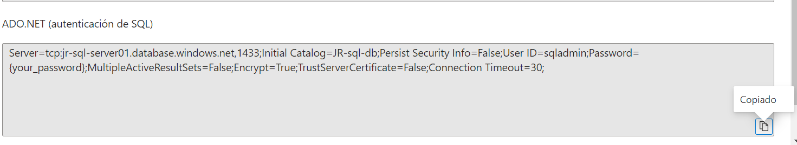
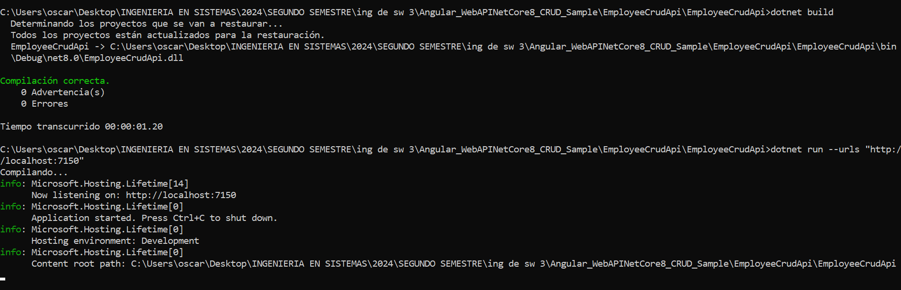
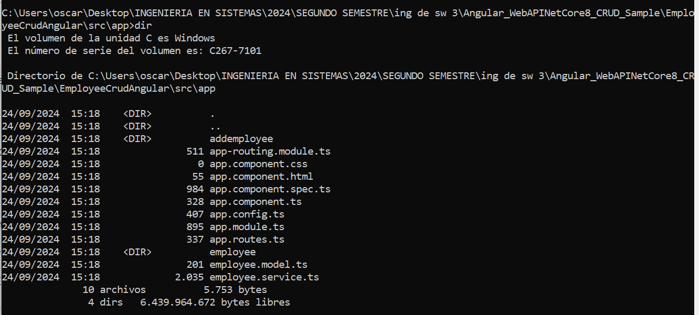
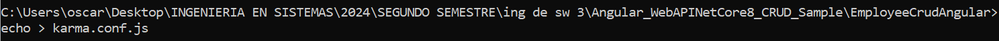

## Trabajo Práctico 6 - Pruebas Unitarias

### 4- Desarrollo:

 

#### 4.1 Creación de una BD SQL Server para nuestra App


A\. Crear una BD Azure SQL Database (Ver Instructivo 5.1)





#### 4.2 Obtener nuestra App
A\. Clonar el repo https://github.com/ingsoft3ucc/Angular_WebAPINetCore8_CRUD_Sample.git

B\. Seguir las instrucciones del README.md del repo clonado prestando atención a la modificación de la cadena de conexión en el appSettings.json para que apunte a la BD creada en 4.1 


C\. Navegar a http://localhost:7150/swagger/index.html y probar uno de los controladores para verificar el correcto funcionamiento de la API.


D\. Navegar a http://localhost:4200 y verificar el correcto funcionamiento de nuestro front-end Angular


E\. Una vez verificado el correcto funcionamiento de la Aplicación procederemos a crear un proyecto de pruebas unitarias para nuestra API.


#### 4.3 Crear Pruebas Unitarias para nuestra API
A\. En el directorio raiz de nuestro repo crear un nuevo proyecto de pruebas unitarias para nuestra API 
```bash
dotnet new xunit -n EmployeeCrudApi.Tests
```


B\. Instalar dependencias necesarias

Primero, instala las siguientes bibliotecas mediante NuGet:


```bash
cd EmployeeCrudApi.Tests 
dotnet add package Moq
dotnet add package xunit
dotnet add package Microsoft.EntityFrameworkCore.InMemory

```


C\. Editar archivo UnitTest1.cs reemplazando su contenido por


D\. Renombrar archivo UnitTest1.cs por EmployeeControllerUnitTests.cs
```bash
mv UnitTest1.cs EmployeeControllerUnitTests.cs 
```


E\. Editar el archivo EmployeeCrudApi.Tests/EmployeeCrudApi.Tests.csproj para agregar una referencia a nuestro proyecto de EmployeeCrudApi reemplazando su contenido por


F\. Ejecutar los siguientes comandos para ejecutar nuestras pruebas
G\. Verificar que se hayan ejecutado correctamente las pruebas


```bash
dotnet build


dotnet test


```


H\. Verificar que no estamos usando una dependencia externa como la base de datos.

I\. Modificar la cadena de conexión en el archivo appsettings.json para que use un usuario o password incorrecto y recompilar el proyecto EmployeeCrudApi


```bash
dotnet build
dotnet run --urls "http://localhost:7150"
```
J\. Verificar que nuestro proyecto ya no tiene acceso a la BD navegando a http://localhost:7150/swagger/index.html y probando uno de los controladores:


K\. En la carpeta de nuestro proyecto EmployeeCrudApi.Tests volver a correr las pruebas
L\. Verificar que se hayan ejecutado correctamente las pruebas inclusive sin tener acceso a la BD, lo que confirma que es efectivamente un conjunto de pruebas unitarias que no requieren de una dependencia externa para funcionar.

```bash
dotnet build


dotnet test


```


M\. Modificar la cadena de conexión en el archivo appsettings.json para que use el usuario y password correcto y recompilar el proyecto EmployeeCrudApi


```bash
dotnet build
dotnet run --urls "http://localhost:7150"
```




N\. Verificar que nuestro proyecto vuelve a tener acceso a la BD navegando a http://localhost:7150/swagger/index.html y probando uno de los controladores:


#### 4.4 Creamos pruebas unitarias para nuestro front de Angular:

A\. Nos posicionamos en nuestro proyecto de front, en el directorio EmployeeCrudAngular/src/app
```bash
pwd
```


B\. Editamos el archivo app.component.spec.ts reemplazando su contenido por:


C\. Creamos el archivo employee.service.spec.ts reemplazando su contenido por:


D\. Editamos el archivo employee.component.spec.ts ubicado en la carpeta **employee** reemplazando su contenido por:


E\. Editamos el archivo addemployee.component.spec.ts ubicado en la carpeta **addemployee** reemplazando su contenido por:


F\. En el directorio raiz de nuestro proyecto EmployeeCrudAngular ejecutamos el comando 
```bash
ng test
```
En proyectos de Angular, Jasmine se usa para escribir las pruebas, y Karma se encarga de ejecutarlas. Cuando ejecutamos el comando ng test, Karma se inicia, carga las pruebas escritas en Jasmine, y las ejecuta en un navegador.

G\. Vemos que se abre una ventana de Karma con Jasmine en la que nos indica que los tests se ejecutaron correctamente


H\. Vemos que los tests se ejecutaron correctamente:


I\. Verificamos que no esté corriendo nuestra API navegando a http://localhost:7150/swagger/index.html y recibiendo esta salida:


J\. Los puntos G y H nos indican que se han ejecutado correctamente las pruebas inclusive sin tener acceso a la API, lo que confirma que es efectivamente un conjunto de pruebas unitarias que no requieres de una dependencia externa para funcionar.

#### 4.5 Agregamos generación de reporte XML de nuestras pruebas de front.
Para cuando integremos nuestras pruebas en un pipeline de Build, vamos a necesitar el resultado devuelto por nuestras pruebas para reportarlas junto a las pruebas de back que se reportan automaticamente. 


Haremos los siguientes pasos para prepararnos:

A\. Instalamos dependencia karma-junit-reporter
```bash
npm install karma-junit-reporter --save-dev
```


B\. En el directorio raiz de nuestro proyecto (al mismo nivel que el archivo angular.json) creamos un archivo karma.conf.js con el siguiente contenido




C\. Ejecutamos nuestros test de la siguiente manera:
```bash
ng test --karma-config=karma.conf.js --watch=false --browsers ChromeHeadless
```


D\. Verificamos que se creo un archivo test-result.xml en el directorio test-results que está al mismo nivel que el directorio src


#### 4.6 Modificamos el código de nuestra API y creamos nuevas pruebas unitarias:

A\. Realizar al menos 5 de las siguientes modificaciones sugeridas al código de la API:


 
B\. Crear las pruebas unitarias necesarias para validar las modificaciones realizadas en el código


#### 4.7 Modificamos el código de nuestro Front y creamos nuevas pruebas unitarias:

A\. Realizar en el código del front las mismas modificaciones hechas a la API. 


B\. Las validaciones deben ser realizadas en el front sin llegar a la API, y deben ser mostradas en un toast como por ejemplo https://stackblitz.com/edit/angular12-toastr?file=src%2Fapp%2Fapp.component.ts o https://stackblitz.com/edit/angular-error-toast?file=src%2Fapp%2Fcore%2Frxjsops.ts

C\. Crear las pruebas unitarias necesarias en el front para validar las modificaciones realizadas en el código del front.


